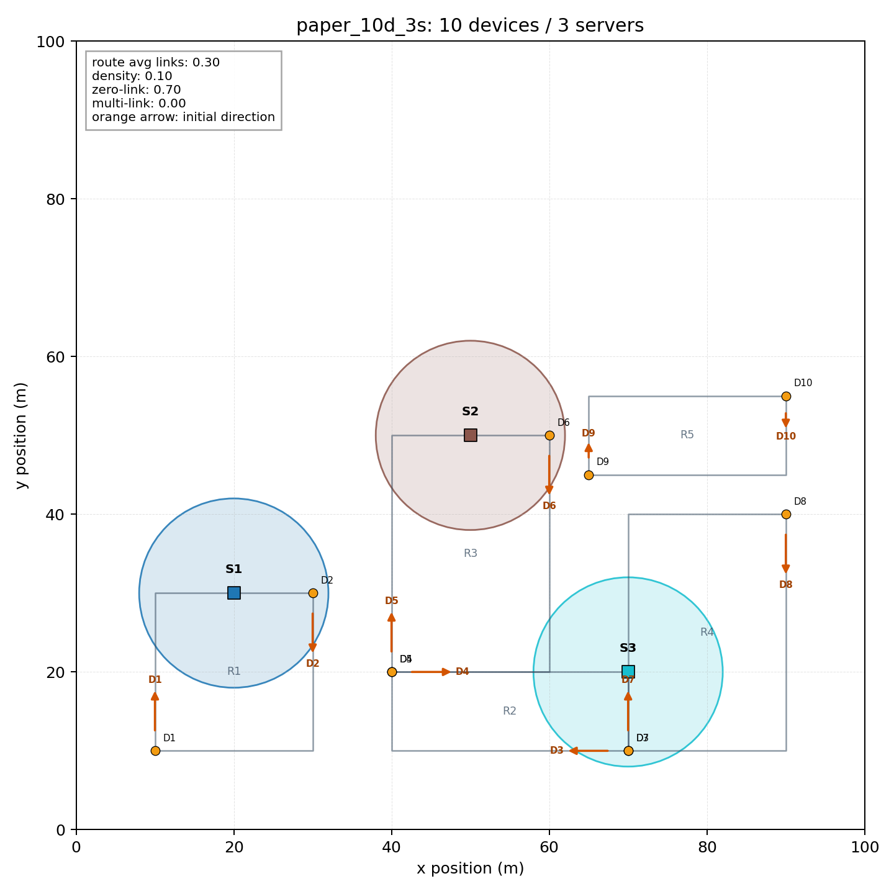
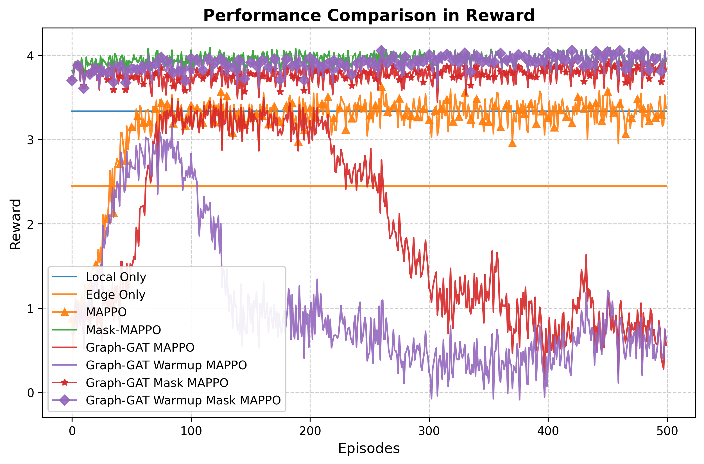
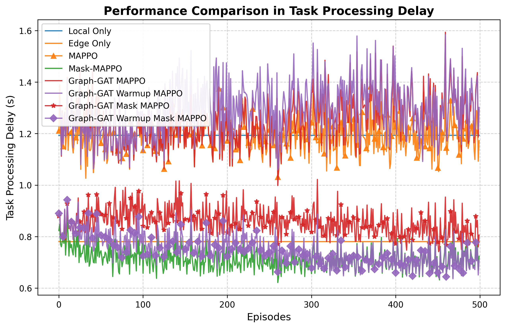
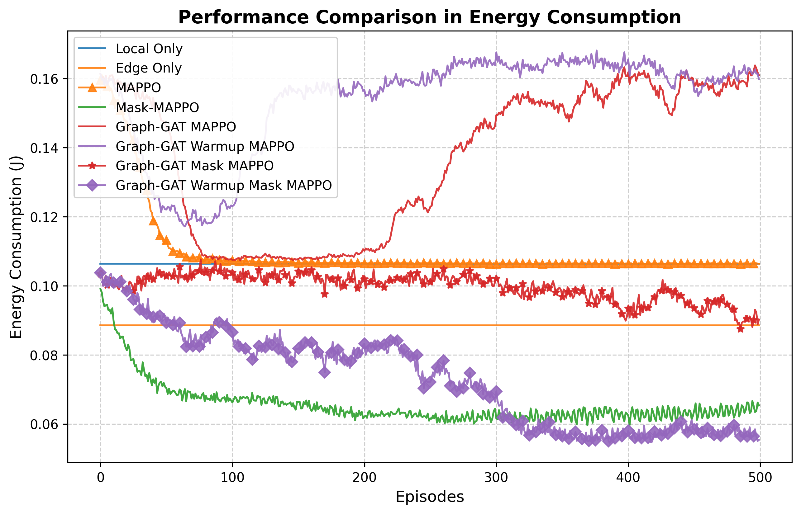
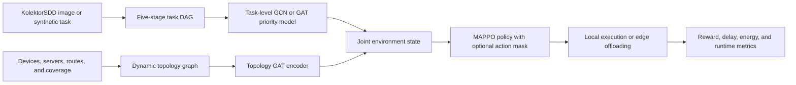

# Graph Attention and DRL for Task Offloading in Dynamic DITENs

[](https://www.python.org/)
[](https://pytorch.org/)
[](#project-status)

<p align="center">
  <strong>Attention-aware task prioritization · Topology-aware offloading · Scalable multi-agent evaluation</strong>
</p>

This repository presents a research implementation of **graph-attention-enhanced
multi-agent deep reinforcement learning** for dependent task offloading in
**Digital Twin Edge Networks (DITENs)**. Industrial image-recognition workloads
are represented as directed acyclic graphs (DAGs), while learning agents decide
whether each subtask should run locally on a mobile industrial device or be
offloaded to a feasible edge server.

> **Research objective:** learn adaptive offloading policies that balance system
> reward, processing delay, and energy consumption under task dependencies,
> device mobility, and time-varying server coverage.

## Core contributions

| Component | Role in the framework |
| --- | --- |
| **Task-level GAT** | Learns dependency-aware representations and execution priorities from image-processing task DAGs. |
| **Topology-level GAT** | Encodes dynamic relationships among mobile devices, edge servers, and available communication links. |
| **Multi-agent MAPPO** | Coordinates decentralized offloading decisions through centralized policy optimization. |
| **Coverage-aware action masking** | Removes unreachable edge servers from the action space and prevents infeasible offloading decisions. |
| **Scalable evaluation suite** | Compares learning-based and fixed baselines across 10-, 20-, and 30-device network scenarios. |

## Environment and experimental snapshot

<p align="center">
  
  <br>
  <sub><b>Paper-scale topology:</b> 10 mobile industrial devices, 3 edge servers, fixed routes, and coverage-constrained connectivity.</sub>
</p>

<p align="center">
  <b>Representative medium-scale training run · 20 devices · 6 edge servers · 500 episodes</b>
</p>

<table>
  <tr>
    <td colspan="2" align="center">
      
      <br>
      <sub><b>System reward</b> across the evaluated offloading strategies.</sub>
    </td>
  </tr>
  <tr>
    <td width="50%" align="center">
      
      <br>
      <sub><b>Processing delay</b></sub>
    </td>
    <td width="50%" align="center">
      
      <br>
      <sub><b>Energy consumption</b></sub>
    </td>
  </tr>
</table>

<p align="center">
  <sub>Curves are shown as an experimental snapshot. Final comparisons should be reported across multiple seeds with identical configurations.</sub>
</p>


## Research motivation

Industrial image-recognition pipelines contain dependent stages such as image
extraction, denoising, standardization, feature extraction, and recognition.
Executing every stage locally can increase latency and energy consumption, while
blindly offloading tasks can fail when devices move outside server coverage.

This project represents each workload as a task DAG and the mobile edge network
as a changing graph. Attention mechanisms learn which task dependencies and
network connections matter most for the current offloading decision.

## System workflow



## Implemented features

- Multi-slot DITEN simulator with mobile devices, fixed edge servers,
  communication delay, execution delay, energy use, queues, and coverage windows.
- Five-stage industrial image-recognition tasks represented as DAGs.
- GCN and GAT task-priority models with checkpointed pretraining.
- MAPPO, masked MAPPO, and topology Graph-GAT MAPPO variants.
- Optional topology-encoder warmup and separate encoder learning rate.
- Fixed local-only and edge-only baselines.
- Three topology scenarios:
  - `paper_10d_3s`: 10 devices and 3 servers;
  - `medium_20d_6s`: 20 devices and 6 servers;
  - `large_30d_10s`: 30 devices and 10 servers.
- CPU/CUDA device selection for Graph-GAT models.
- Optional Weights & Biases experiment tracking.
- Timestamped plots, JSONL summaries, and PyTorch checkpoints.
- Unit tests for environment invariants, policy updates, action masking, topology
  graphs, GPU readiness, metrics, and experiment tracking.

## Repository structure

```text
e-ATN-MADDPG-project/
└── Industrial_task_offloading/
    ├── baselines/        # MAPPO, MAAC, Graph-GAT MAPPO, and fixed policies
    ├── benchmarks/       # Environment runtime profiling
    ├── dataset/          # KolektorSDD loader and synthetic fallback
    ├── docs/             # Experiment, GPU, W&B, and reproduction notes
    ├── environment/      # Network, system, mobility, and DITEN simulation
    ├── models/           # GCN/GAT, MADDPG, topology encoder, replay buffer
    ├── paper/            # IEEE manuscript and references
    ├── tests/            # Automated test suite
    ├── utils/            # Configuration, metrics, plots, tracking, topologies
    ├── main.py           # Standalone e-ATN-MADDPG training entry point
    └── run_comparision.py # Multi-algorithm experiment runner
```

> The filename `run_comparision.py` is intentionally shown as it currently
> exists in the repository.

## Installation

### 1. Clone and enter the project

```bash
git clone https://github.com/ngocdung211/e-ATN-MADDPG-project.git
cd e-ATN-MADDPG-project/Industrial_task_offloading
```

### 2. Create a virtual environment

```bash
python -m venv .venv
source .venv/bin/activate
python -m pip install --upgrade pip
```

On Windows PowerShell:

```powershell
python -m venv .venv
.venv\Scripts\Activate.ps1
python -m pip install --upgrade pip
```

### 3. Install dependencies

```bash
python -m pip install -r requirements.txt
python -m pip install numpy torch pytest
```

For optional W&B monitoring:

```bash
python -m pip install -r requirements-wandb.txt
```

For CUDA training, install the PyTorch build recommended by the official
[PyTorch installation selector](https://pytorch.org/get-started/locally/). The
environment simulator remains on CPU; CUDA acceleration applies to the
Graph-GAT policy and its model-input tensors.

## Dataset

The loader expects the Kolektor Surface-Defect Dataset under:

```text
Industrial_task_offloading/dataset/KolektorSDD/
```

If the dataset is absent, the project prints a warning and generates synthetic
task parameters. This fallback is useful for tests and smoke runs, but it is not
equivalent to a dataset-backed reproduction. The loader reports whether the
local dataset matches the 399 images expected by the reference experiment.

Review the KolektorSDD license and access terms before downloading or
redistributing the data.

## Quick start

### Run the automated tests

```bash
pytest tests -q
```

### Check CPU/CUDA readiness

```bash
python -m utils.gpu_readiness --preferred-device auto
```

To require CUDA and return a machine-readable report:

```bash
python -m utils.gpu_readiness --preferred-device cuda --json
```

### Preview a topology

```bash
python -m utils.topology_scenario_preview \
  --output-dir topology_preview
```

This command renders all three configured topology scenarios and writes their
connectivity metrics to `topology_metrics.json`.

### Run a short smoke experiment

```bash
python run_comparision.py \
  --topology-scenario paper_10d_3s \
  --episodes 1 \
  --baseline-episodes 1 \
  --algorithms "Mask-MAPPO" "Graph-GAT Warmup Mask MAPPO" \
  --graph-gat-device auto \
  --wandb-mode disabled \
  --note smoke-test
```

### Run the configured comparison suite

```bash
python run_comparision.py \
  --topology-scenario paper_10d_3s \
  --episodes 500 \
  --baseline-episodes 5 \
  --graph-gat-device auto \
  --wandb-mode disabled \
  --note paper-comparison
```

When `--algorithms` is omitted, the current configuration runs:

- Local Only and Edge Only;
- MAPPO and Mask-MAPPO;
- Graph-GAT MAPPO;
- Graph-GAT Warmup MAPPO;
- Graph-GAT Mask MAPPO; and
- Graph-GAT Warmup Mask MAPPO.

MADDPG/e-ATN-MADDPG, MAAC, random offloading, and feature-extraction-only
baselines are implemented but currently commented out in the default comparison
configuration.

### Train the standalone e-ATN-MADDPG path

```bash
python main.py
```

This entry point uses the paper-scale 10-device/3-server environment and the
training settings in `utils/paper_config.py`.

## Experiment outputs

Comparison runs create a timestamped directory under `plots/` containing:

- reward, delay, and energy curves;
- one JSONL row per algorithm with final training metrics; and
- `.pt` checkpoints for trainable policies.

The tracked metrics include reward, delay, energy, requested/resolved local and
edge actions, penalties, simulated execution components, environment runtime,
graph construction time, PPO update time, and CUDA memory statistics.

## Optional W&B monitoring

W&B is disabled by default. After installing the optional dependency and logging
in, enable online tracking with:

```bash
python run_comparision.py \
  --topology-scenario medium_20d_6s \
  --episodes 20 \
  --algorithms "Graph-GAT Warmup Mask MAPPO" \
  --graph-gat-device cuda \
  --wandb-mode online \
  --wandb-project industrial-task-offloading \
  --note medium-gpu-run
```

API keys must be configured through W&B or environment variables and must never
be committed. The integration does not upload the dataset, source code, or model
checkpoints.

## Reproducibility

Experiment defaults are centralized in `utils/paper_config.py`:

- `confirmed` contains values traced to the paper text;
- `provisional_table2_needed` contains current defaults that still require
  verification against the reference paper's Table II.

The default experiment seed is `75`. For a valid comparison, keep the topology,
seed, episode count, dataset mode, and reward weights fixed across algorithms.
Report results over a window or multiple seeds rather than selecting a single
best episode.

## Project status

This repository is an active research prototype. It contains a working
simulation, training pipelines, ablations, tests, and an IEEE-format manuscript,
but the following items should be completed before claiming a final paper
reproduction:

- verify every provisional parameter against the reference paper;
- run multi-seed experiments on consistent hardware;
- store the exact dataset version and environment metadata;
- validate the final result tables from saved raw outputs; and
- add a repository license.

The README intentionally does not quote performance improvements because no
versioned final benchmark outputs are currently committed. Add measured results
only after the corresponding configuration, seeds, and artifacts are available.

